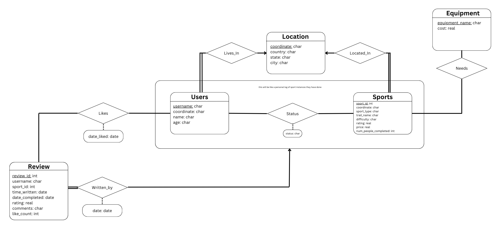

# Sport Search: Find the best sport to do!

# Demo
The GIF for the demo is below and may take a couple seconds to load.


# Table of Contents
1. [Introduction](#introduction)
2. [Database Architecture](#database-architecture)
    - [Entity Relationship Diagram](#entity-relationship-diagram)
    - [SQL Mappings](#sql-mappings)
    - [Explanation of Entities and Relations](#explanation-of-entities-and-relations)
    - [Potential Interaction Flow](#potential-interaction-flow)
3. [Getting Started](#getting-started)
4. [Reflection](#reflection)
5. [Notes](#notes)

# Introduction
This project was built for my Introductions to Database course with my partner, Sally Liu. Our focus for this project was to design a database for an application of our interest, which in this case, was a sports finder. Sports supported include: skiing, scuba diving, kayaking, biking, and cycling. Emphasis was placed on developing a well thought out ER diagram, and mapping the correct constraints into a PostgreSQL database without using object-relational features. The Python Flask framework was then utilized to create an intuitive way to interact with our database.

### Features
1. Registration and login
2. Dynamic search function with many filters available
3. Allow users to add new sport entries
4. Users can keep track of their saved and completed sports
5. Users can leave reviews and interact with other users’ reviews

# Database Architecture
### Entity Relationship Diagram


### SQL Mappings
Create these tables in the same order as listed.
```SQL
CREATE TABLE “Location”(
  coordinate VARCHAR(100),
  country VARCHAR(40),
  state VARCHAR(40),
  city VARCHAR(40),
  PRIMARY KEY (coordinate));

CREATE TABLE “Users”(
  username VARCHAR(20),
  coordinate VARCHAR(100) NOT NULL,
  name VARCHAR NOT NULL,
  age INTEGER,
  CHECK (age >= 0),
  PRIMARY KEY (username),
  FOREIGN KEY (coordinate) REFERENCES “Location”);

CREATE TABLE “Sports”(
  sport_id INTEGER,
  coordinate VARCHAR(100) NOT NULL,
  sport_type VARCHAR(20) CHECK (sport_type IN (‘skiing’,   ‘hiking’, ‘biking’, ‘kayaking’, ‘scuba diving’)) NOT NULL,
  trail_name VARCHAR(100) NOT NULL,
  difficulty VARCHAR(20) CHECK (difficulty IN (‘beginner’, ‘intermediate’, ‘advanced’)) NOT NULL,
  rating REAL,
  CHECK (rating >= 0 AND rating <= 5),
  price REAL,
  CHECK (price >= 0),
  num_people_completed INTEGER,
  CHECK (num_people_completed  >= 0),
  PRIMARY KEY (spots_id),
  FOREIGN KEY (coordinate) REFERENCES “Location”);

CREATE TABLE “Equipment”(
  equipment_name VARCHAR,
  cost: REAL,
  CHECK (cost >= 0),
  PRIMARY KEY (equipment_name));

CREATE TABLE “Needs”(
  equipment_name VARCHAR,
  sport_id INTEGER,
  PRIMARY KEY (equipment_name, sport_id),
  FOREIGN KEY (equipment_name) REFERENCES Equipment,
  FOREIGN KEY (sport_id) REFERENCES “Sports”
 ON DELETE CASCADE)

CREATE TABLE “Status”(
  username VARCHAR(20),
  sport_id INTEGER,
  status VARCHAR CHECK (status IN (‘completed’, ‘saved’)),
  PRIMARY KEY (username, sport_id),
  FOREIGN KEY (username) REFERENCES “Users”,
 ON DELETE CASCADE,
  FOREIGN KEY (sport_id) REFERENCES “Sports”
 ON DELETE CASCADE);

CREATE TABLE “Review”(
  review_id INTEGER,
  username VARCHAR(20) NOT NULL,
  sport_id INTEGER NOT NULL,
  time_written DATE NOT NULL,
  date_completed DATE,
  CHECK(time_written >= date_completed),
  rating INTEGER, 
  CHECK (rating >= 0 AND rating <= 5),
  comments VARCHAR,
  like_count INTEGER,
  CHECK (like_count >= 0)
  PRIMARY KEY (review_id),
  FOREIGN KEY (username, sport_id) REFERENCES “Status” ON DELETE CASCADE);

CREATE TABLE “Likes”(
  review_id INTEGER,
  username VARCHAR(20),
  date_liked DATE,
  PRIMARY KEY (review_id, username),
  FOREIGN KEY (review_id) REFERENCES “Review”,
 ON DELETE CASCADE,
  FOREIGN KEY (username) REFERENCES “Users”
 ON DELETE CASCADE);
```

### Explanation of Entities and Relations
We have entity sets: Users, Review, Sports, Location, and Equipment. Each User has a unique username, along with attributes like age, name, and coordinate. Review has a unique review_id, with attributes such as username, date, rating, comments, and like_count (how many likes they receive). Sports has a unique sport_id, with attributes including coordinate, sports_type (Hiking, Skiing, Biking, Scuba Diving, or Kayaking), difficulty, rating, price, and num_people_completed. Location has a unique coordinate with country, state, and city attributes, and Equipment has a unique name and cost.

Each user lives in one specific location and can have two status - either save or complete a sport. Users can write a review for a completed sport, and each review is tied to one user-sport combination. Users can like others’ reviews, but only once per review. Sports are located in exactly one location and can need none or multiple pieces of equipment. Sports can also have a related piece of equipment.

### Potential Interaction Flow
The user can search for the outdoor activities they want by the sports category, location, difficulty, prices, and ratings, etc., and find out the equipment they need. They can then save the sport for later like a bookmark. After participating in an activity, they can then leave a review to share their experience, which will then mark this specific sport as completed. Users can also interact with each other by ‘liking’ other’s review’s. At the same time, users who discover new activity locations can add them into the database, making the system more diverse and comprehensive. 

# Getting Started
## Installation: 
1. Clone this repository to your system. In the console, type in `git clone https://github.com/MatthewLabasan/sport-search.git`
2. From the terminal, `cd` to the `webserver` folder and run `pip install -r requirements.txt`
3. Open `server.py` and add your database URI to line 31. Ensure the database schema matches the schema included above.
4. Run `python server,py` in the `webserver` folder to start the program!  

# Reflection
### Difficulties Encountered
1. Fitting the constraints, where we needed to include 5-7 entities and 5-7 relationships. This pushed us to think critically about how each entity would interact with each other as well as how we can map these relationships and interactions
2. Developing the right queries based on the search criteria given through the search form 
3. Populating the database with placeholder data for testing
4. Getting familiar with Flask

### What I Learned
Through this project, I gained skills and knowledge in best practices for developing scalable ER diagrams, and how to translate them into SQL! I learned how to properly query this data and utilize libraries such as SQLAlchemy to work with raw SQL in frameworks such as Flask, giving me a greater understanding of what is happening under the hood when working with frameworks/libraries that provide an ORM, such as Django. Overall, this was a fun project that allowed me to not only use the skills I learned in class to develop a useful application, but also build on what I have learned through previous software development projects and really understand what is going on under the hood.

# Notes
__Routes__: Due to the time constraints of this project, API routes are placed directly into the `server.py` file. An attempt was made to compartmentalize routes for the home page, however the rest are left in the `server.py` file.
__Locations__: When adding a new sport, coordinates will need to be in the form `latitude, longitude`. A Python library will handle converting these coordinates into real metadata.